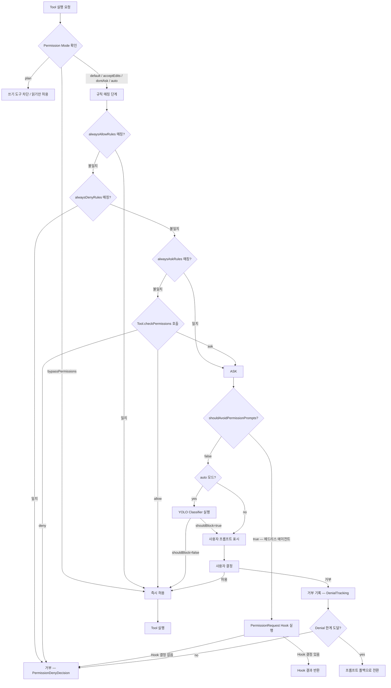

# 권한 시스템: Permission Model 분석

## 1. 개요

Permission System (권한 시스템)은 Claude Code에서 Tool (도구)을 실행하기 전 사용자의 승인을 관리하는 보안 레이어다. 단순한 yes/no 프롬프트가 아니라, 다계층 규칙 기반(rule-based) 평가 파이프라인으로 설계되어 있으며, 현재 모드(mode)·규칙(rule)·분류기(classifier)·훅(hook)이 순차적으로 적용된다.

**핵심 위치**

| 관심사 | 경로 |
|---|---|
| 타입 정의 | `src/types/permissions.ts` |
| Context 타입 | `src/Tool.ts` (`ToolPermissionContext`) |
| 모드 정의 | `src/utils/permissions/PermissionMode.ts` |
| 권한 체크 로직 | `src/utils/permissions/permissions.ts` |
| 초기화 및 모드 전환 | `src/utils/permissions/permissionSetup.ts` |
| 거부 추적 | `src/utils/permissions/denialTracking.ts` |
| Auto 모드 분류기 | `src/utils/permissions/yoloClassifier.ts` |
| 모드 순환 | `src/utils/permissions/getNextPermissionMode.ts` |

---

## 2. 아키텍처 다이어그램



---

## 3. Permission Mode 타입

Permission Mode (권한 모드)는 시스템 전체의 기본 동작 방침을 결정한다. 외부(External)에서 사용자가 설정할 수 있는 모드와 내부(Internal) 전용 모드로 구분된다.

### 3.1 External Permission Mode

`src/types/permissions.ts`에서 `EXTERNAL_PERMISSION_MODES`로 선언되며, 사용자 설정(`settings.json`의 `defaultMode`)과 CLI 플래그(`--permission-mode`)에서 사용할 수 있다.

| 모드 | 심볼 | 색상 키 | 설명 |
|---|---|---|---|
| `default` | (없음) | `text` | 표준 동작. Tool별 `checkPermissions` 로직에 따라 ask/allow 결정 |
| `plan` | ⏸ | `planMode` | 읽기 전용 Plan Mode. 파일 쓰기·명령 실행 등 상태 변경 Tool 차단 |
| `acceptEdits` | ⏵⏵ | `autoAccept` | 파일 편집 자동 수락. Bash 실행은 여전히 확인 요구 |
| `bypassPermissions` | ⏵⏵ | `error` | 모든 권한 체크 우회. `isBypassPermissionsModeAvailable`이 `true`일 때만 활성화 가능 |
| `dontAsk` | ⏵⏵ | `error` | 권한 프롬프트 없이 거부 대신 자동 허용. `bypassPermissions`와 유사하나 의미론적으로 구분 |

### 3.2 Internal Permission Mode

`auto` 모드는 `TRANSCRIPT_CLASSIFIER` feature flag가 활성화된 ant(내부) 빌드에서만 사용 가능하다. 외부 공개 모드 목록(`EXTERNAL_PERMISSION_MODES`)에는 포함되지 않으며, `toExternalPermissionMode()`를 통해 `'default'`로 매핑된다.

`bubble` 모드는 타입 정의에만 존재하며 현재 UI 순환에 노출되지 않는다.

### 3.3 모드 순환 (Shift+Tab)

`getNextPermissionMode()` 함수가 Shift+Tab 입력 시 다음 모드를 결정한다.

```
일반 사용자:  default → acceptEdits → plan → [bypassPermissions →] [auto →] default
ant 내부:    default → [bypassPermissions →] [auto →] default
```

`bypassPermissions`는 `isBypassPermissionsModeAvailable`이 `true`일 때만 순환에 포함되고, `auto`는 `isAutoModeAvailable`과 런타임 feature gate가 모두 활성화되어야 포함된다.

---

## 4. ToolPermissionContext 분석

`ToolPermissionContext`는 `src/Tool.ts`에서 `DeepImmutable<{...}>`로 정의된다. `DeepImmutable` (깊은 불변 타입) 래퍼가 적용되어 런타임 중 권한 컨텍스트가 외부에서 변조되는 것을 타입 수준에서 방지한다.

```typescript
export type ToolPermissionContext = DeepImmutable<{
  mode: PermissionMode
  additionalWorkingDirectories: Map<string, AdditionalWorkingDirectory>
  alwaysAllowRules: ToolPermissionRulesBySource
  alwaysDenyRules: ToolPermissionRulesBySource
  alwaysAskRules: ToolPermissionRulesBySource
  isBypassPermissionsModeAvailable: boolean
  isAutoModeAvailable?: boolean
  strippedDangerousRules?: ToolPermissionRulesBySource
  shouldAvoidPermissionPrompts?: boolean
  awaitAutomatedChecksBeforeDialog?: boolean
  prePlanMode?: PermissionMode
}>
```

### 4.1 각 필드 설명

**`mode: PermissionMode`**
현재 활성 모드. 권한 평가의 첫 번째 분기점이다.

**`additionalWorkingDirectories: Map<string, AdditionalWorkingDirectory>`**
기본 작업 디렉터리 외에 파일 접근을 허용할 추가 경로 목록. 각 항목은 `path`와 `source`(어떤 설정에서 추가되었는지)를 포함한다.

**`alwaysAllowRules / alwaysDenyRules / alwaysAskRules: ToolPermissionRulesBySource`**
세 가지 규칙 목록. 모두 `ToolPermissionRulesBySource` 타입으로, 규칙의 출처(source)별로 문자열 배열을 저장한다.

```typescript
type ToolPermissionRulesBySource = {
  [T in PermissionRuleSource]?: string[]
}
```

출처(`PermissionRuleSource`)는 `userSettings`, `projectSettings`, `localSettings`, `flagSettings`, `policySettings`, `cliArg`, `command`, `session` 중 하나다. 이 출처 정보는 `createPermissionRequestMessage()`에서 사용자에게 "어느 설정 파일의 규칙이 이 요청을 차단했는지" 설명할 때 사용된다.

**`isBypassPermissionsModeAvailable: boolean`**
`bypassPermissions` 모드로 전환 가능한지 여부. 보안 민감 환경에서 `false`로 설정해 모드 접근 자체를 차단한다.

**`isAutoModeAvailable?: boolean`**
Auto 모드 게이트(Statsig feature gate 등)를 통과했는지 캐시된 값. 런타임에 live check(`isAutoModeGateEnabled()`)와 함께 `canCycleToAuto()`에서 이중 검증된다.

**`strippedDangerousRules?: ToolPermissionRulesBySource`**
Auto 모드 진입 시 제거된 위험 규칙의 원본 보관소. `isDangerousBashPermission()` 등이 탐지한 규칙들이 이 필드에 저장되며, 모드 이탈 시 복원에 사용된다.

**`shouldAvoidPermissionPrompts?: boolean`**
`true`이면 사용자 인터페이스를 띄울 수 없는 헤드리스(headless) 에이전트 환경임을 의미한다. 이 경우 ask 결정은 프롬프트 대신 `PermissionRequest` 훅을 거쳐 자동 거부된다.

**`awaitAutomatedChecksBeforeDialog?: boolean`**
`true`이면 사용자 다이얼로그 표시 전에 분류기·훅 등 자동화 체크가 완료될 때까지 대기한다. 코디네이터(coordinator) 워커 환경에서 활성화된다.

**`prePlanMode?: PermissionMode`**
모델이 자체적으로 Plan Mode에 진입하기 전의 원래 모드를 저장한다. Plan Mode 이탈 시 이 값으로 복원한다.

### 4.2 빈 컨텍스트 초기값

`getEmptyToolPermissionContext()`는 다음 기본값을 반환한다.

```typescript
{
  mode: 'default',
  additionalWorkingDirectories: new Map(),
  alwaysAllowRules: {},
  alwaysDenyRules: {},
  alwaysAskRules: {},
  isBypassPermissionsModeAvailable: false,
}
```

---

## 5. 권한 체크 흐름

### 5.1 규칙 매칭 단계

`permissions.ts`의 `getAllowRules()`, `getDenyRules()`, `getAskRules()`는 각각 `PERMISSION_RULE_SOURCES` 순서(`userSettings` → `projectSettings` → `localSettings` → `flagSettings` → `policySettings` → `cliArg` → `command` → `session`)로 규칙을 평탄화(flatMap)하여 반환한다.

**Tool 수준 매칭 (`toolMatchesRule`)**

규칙에 `ruleContent`가 없으면 Tool 전체에 대한 매칭이다. MCP (Model Context Protocol) 도구는 `mcp__serverName__toolName` 형식으로 식별되며, 서버 수준 규칙(`mcp__server1`)은 해당 서버의 모든 도구에 적용된다.

**콘텐츠 수준 매칭 (`getRuleByContentsForTool`)**

`ruleContent`가 있는 경우 도구별 커스텀 매칭 로직(`Tool.checkPermissions()`)이 사용된다. 예를 들어 BashTool은 `Bash(git commit:*)` 형식으로 특정 명령 패턴에만 규칙을 적용한다.

### 5.2 복합 명령 처리

Bash 등 복합 명령을 실행하는 도구는 `subcommandResults` 타입의 `PermissionDecisionReason`을 반환할 수 있다. 하나의 명령 라인에 여러 서브커맨드가 있을 때, 각각을 독립적으로 평가한 결과를 맵으로 반환한다. 어느 하나라도 `ask` 또는 `passthrough`이면 전체가 사용자 프롬프트로 에스컬레이션된다.

### 5.3 PermissionDecision 타입 계층

```
PermissionResult
├── PermissionDecision
│   ├── PermissionAllowDecision  — behavior: 'allow'
│   ├── PermissionAskDecision    — behavior: 'ask', message, suggestions?, pendingClassifierCheck?
│   └── PermissionDenyDecision   — behavior: 'deny', message, decisionReason (필수)
└── passthrough                  — 상위 처리기로 위임
```

`PermissionAskDecision`의 `suggestions` 필드에는 사용자가 규칙을 영구 저장할 수 있는 `PermissionUpdate` 목록이 포함될 수 있다. 예를 들어 "이 명령을 항상 허용"을 클릭하면 `{type: 'addRules', destination: 'projectSettings', ...}` 형태의 업데이트가 실행된다.

---

## 6. 자동 모드 (Auto Mode)

### 6.1 게이트 접근 검증

Auto 모드는 다중 게이트 구조로 보호된다.

1. **Feature flag**: `TRANSCRIPT_CLASSIFIER` 빌드 플래그가 활성화된 빌드에서만 컴파일됨
2. **사용자 타입**: `process.env.USER_TYPE === 'ant'`인 내부 사용자 전용
3. **Statsig gate**: 런타임 feature gate 통과 필요 (`isAutoModeGateEnabled()`)
4. **모델 지원**: `modelSupportsAutoMode()`로 현재 메인 루프 모델이 auto 모드를 지원하는지 확인
5. **보안 제한 게이트**: `checkSecurityRestrictionGate()`

`verifyAutoModeGateAccess()` 함수가 세션 시작 시 위 조건들을 확인하고 결과를 `isAutoModeAvailable`에 캐시한다.

### 6.2 YOLO Classifier

`yoloClassifier.ts`의 YOLO (You Only Live Once) Classifier (분류기)는 Auto 모드에서 사용자 프롬프트 없이 도구 실행 여부를 자동 판단하는 LLM 기반 분류기다.

`YoloClassifierResult` 타입은 다음 주요 필드를 포함한다.

| 필드 | 설명 |
|---|---|
| `shouldBlock` | `true`이면 실행 차단 (사용자 프롬프트로 에스컬레이션) |
| `reason` | 판단 근거 |
| `unavailable` | API 오류 등으로 분류기 자체가 불가용한 경우 |
| `transcriptTooLong` | 컨텍스트 창 초과 — 동일 입력은 재시도해도 동일 결과이므로 즉시 폴백 |
| `model` | 분류에 사용된 모델 ID |
| `stage` | 2단계 XML 분류기에서 최종 결정을 낸 단계 (`'fast'` or `'thinking'`) |

분류기는 세션의 대화 기록(transcript)을 컨텍스트로 사용하며, `getLastClassifierRequests()`로 이전 요청을 캐싱하여 반복 오버헤드를 줄인다.

### 6.3 위험 권한 제거 (Dangerous Permission Stripping)

Auto 모드 진입 시 `isDangerousBashPermission()` 함수가 `alwaysAllowRules`를 스캔해 분류기를 우회할 수 있는 위험 패턴을 제거한다.

**위험으로 판단하는 패턴:**

```
Bash                  — 도구 전체 허용 (모든 명령 실행 가능)
Bash(*)               — 와일드카드 전체 허용
Bash(python:*)        — 스크립트 인터프리터 prefix 허용
Bash(python*)         — 인터프리터 와일드카드
Bash(node -*)         — 플래그 포함 패턴
```

제거된 규칙은 `strippedDangerousRules`에 보존되며, Auto 모드 이탈 시 복원된다. 동일 로직이 `isDangerousPowerShellPermission()` 함수로 PowerShell에도 적용된다.

### 6.4 Classifier Fail-Closed

분류기가 오류로 불가용 상태가 된 경우, 30분 새로고침 주기(`CLASSIFIER_FAIL_CLOSED_REFRESH_MS`)가 적용된다. 분류기 불가용 시 `buildClassifierUnavailableMessage()`가 메시지를 생성하고 ask 결정으로 폴백한다.

---

## 7. 거부 추적 (Denial Tracking)

`denialTracking.ts`는 분류기 또는 자동화된 체크가 반복적으로 거부할 때 사용자 프롬프트 폴백으로 전환하는 안전망이다.

### 7.1 상태 구조

```typescript
type DenialTrackingState = {
  consecutiveDenials: number  // 연속 거부 횟수
  totalDenials: number        // 총 거부 횟수
}

const DENIAL_LIMITS = {
  maxConsecutive: 3,   // 연속 3회 거부 시 폴백
  maxTotal: 20,        // 총 20회 거부 시 폴백
}
```

### 7.2 상태 전환

- `recordDenial(state)`: 거부 발생 시 두 카운터 모두 증가 (순수 함수, 새 객체 반환)
- `recordSuccess(state)`: 성공 시 `consecutiveDenials`를 0으로 리셋 (총 거부 수는 유지)
- `shouldFallbackToPrompting(state)`: 두 한계 중 하나라도 도달하면 `true` 반환

이 설계는 분류기가 특정 도구 요청을 지속적으로 잘못 판단하거나 과도하게 차단할 때 시스템이 무한 거부 루프에 빠지는 것을 방지한다.

---

## 8. 주요 설계 결정

### 8.1 DeepImmutable을 통한 불변성 보장

`ToolPermissionContext`에 `DeepImmutable` 래퍼를 적용하는 이유는 권한 컨텍스트가 여러 계층의 도구 실행 코드에 전달될 때 의도치 않은 변경을 타입 수준에서 차단하기 위해서다. TypeScript의 표준 `readonly`는 최상위 속성만 보호하지만, `DeepImmutable`은 중첩 구조까지 재귀적으로 읽기 전용으로 만든다.

`src/types/permissions.ts`에는 import cycle (순환 임포트) 문제를 피하기 위해 단순화된 `readonly` 버전의 `ToolPermissionContext`가 별도로 정의되어 있다.

### 8.2 출처 추적 규칙 시스템

규칙을 단순 문자열 배열로 저장하지 않고 `ToolPermissionRulesBySource` 구조를 사용해 출처를 보존한다. 이를 통해:

- 사용자에게 "어느 설정 파일의 어떤 규칙이 이 요청을 제어하는지" 명시적으로 안내할 수 있다
- 프로젝트 설정과 사용자 설정의 규칙이 충돌할 때 우선순위를 관리할 수 있다
- 규칙 삭제 시 올바른 파일에서 제거할 수 있다 (`deletePermissionRuleFromSettings`)

### 8.3 Plan Mode 복원 메커니즘

모델이 대화 중 자체적으로 Plan Mode를 요청할 수 있다 (`prePlanMode` 필드). 이 경우 진입 전 모드를 `prePlanMode`에 저장하고 Plan Mode 이탈 시 복원한다. 이는 사용자가 수동으로 설정한 모드(`acceptEdits` 등)가 모델의 일시적 Plan Mode 진입으로 인해 유실되는 것을 방지한다.

### 8.4 헤드리스 에이전트를 위한 안전한 폴백

`shouldAvoidPermissionPrompts`가 `true`인 환경(백그라운드 에이전트, CI 파이프라인 등)에서는 ask 결정이 사용자 UI를 띄우는 대신 `executePermissionRequestHooks()`를 거친다. 훅이 명시적 결정을 내리지 않으면 자동 거부(`AUTO_REJECT_MESSAGE`)로 처리된다. 이는 UI가 없는 환경에서 시스템이 무한 대기하거나 의도치 않게 위험한 작업을 승인하는 것을 방지하는 설계다.

---

## 9. 주요 타입 요약

```typescript
// 권한 행동 — 규칙이 취하는 조치
type PermissionBehavior = 'allow' | 'deny' | 'ask'

// 규칙 값 — 어떤 도구의 어떤 명령에 적용하는지
type PermissionRuleValue = {
  toolName: string
  ruleContent?: string   // e.g. "git commit:*"
}

// 규칙 — 행동 + 값 + 출처
type PermissionRule = {
  source: PermissionRuleSource
  ruleBehavior: PermissionBehavior
  ruleValue: PermissionRuleValue
}

// 업데이트 — 규칙 추가/제거/변경 명령
type PermissionUpdate =
  | { type: 'addRules'; destination: PermissionUpdateDestination; rules: PermissionRuleValue[]; behavior: PermissionBehavior }
  | { type: 'removeRules'; ... }
  | { type: 'replaceRules'; ... }
  | { type: 'setMode'; destination: ...; mode: ExternalPermissionMode }
  | { type: 'addDirectories'; ... }
  | { type: 'removeDirectories'; ... }

// 결정 이유 — 왜 이 결정이 내려졌는지
type PermissionDecisionReason =
  | { type: 'rule'; rule: PermissionRule }
  | { type: 'mode'; mode: PermissionMode }
  | { type: 'hook'; hookName: string; reason?: string }
  | { type: 'classifier'; classifier: string; reason: string }
  | { type: 'subcommandResults'; reasons: Map<string, PermissionResult> }
  | { type: 'workingDir'; reason: string }
  | { type: 'safetyCheck'; reason: string; classifierApprovable: boolean }
  | ...
```

---

## Navigation

- 이전: [커맨드 시스템](command-system.md)
- 다음: [에이전트 오케스트레이션](agent-coordinator.md)
- 상위: [목차](../README.md)
