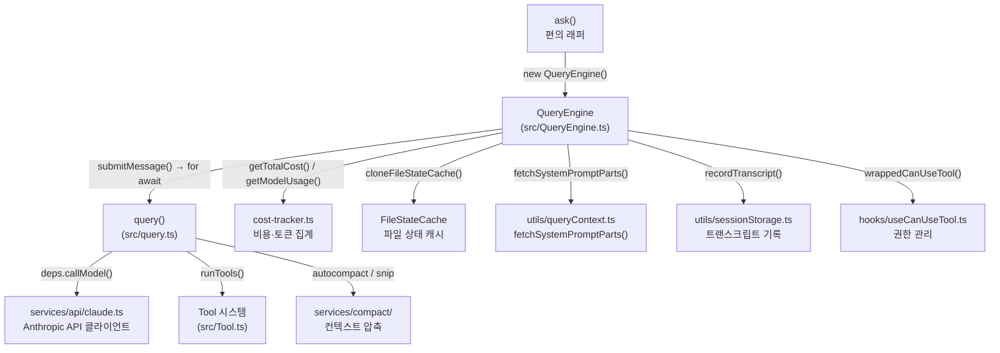
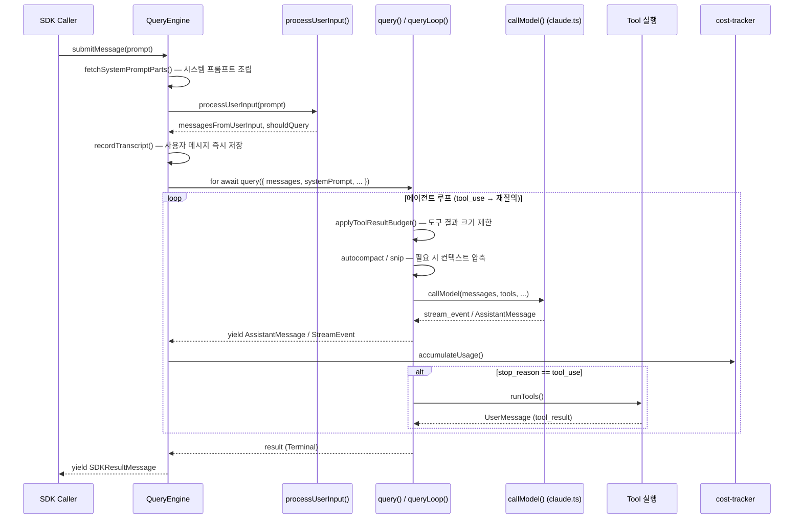

# QueryEngine: LLM API 엔진 분석

## 1. 개요

`QueryEngine`은 Claude Code의 핵심 실행 엔진으로, LLM(Large Language Model, 대형 언어 모델) API 호출, 에이전트 루프(agent loop) 관리, 스트리밍(streaming) 응답 처리를 단일 클래스에서 조율한다. SDK(Software Development Kit) 헤드리스 경로와 REPL(Read-Eval-Print Loop) 인터랙티브 경로 양쪽에서 하나의 대화 세션을 대표하는 객체로 인스턴스화된다.

- **역할**: LLM API 호출, 에이전트 루프 관리, 스트리밍 응답 처리의 중앙 엔진
- **위치**: `src/QueryEngine.ts` (1,295 lines)
- **설계 원칙**: 대화 하나 당 인스턴스 하나. `submitMessage()` 호출마다 새 턴(turn)이 시작되며, 메시지 히스토리·파일 캐시·사용량 집계는 턴 간에 유지된다.

### 의존 관계 다이어그램



---

## 2. 아키텍처 다이어그램

아래 다이어그램은 하나의 `submitMessage()` 호출이 완료될 때까지 데이터가 흐르는 경로를 보여준다.



### 서브시스템별 역할 요약

| 모듈 | 역할 |
|---|---|
| `src/QueryEngine.ts` | 세션 상태 유지, 턴 오케스트레이션, SDK 메시지 변환 |
| `src/query.ts` | API 호출 루프, 압축 트리거, 도구 실행 조율 |
| `src/services/api/claude.ts` | Anthropic 베타 API 클라이언트, 스트리밍 파싱 |
| `src/cost-tracker.ts` | 모델별 토큰·비용 누적 집계 |
| `src/services/compact/` | 자동 압축, 스닙(snip), 반응형 압축 |
| `src/utils/fileStateCache.ts` | 파일 읽기 캐시, 언두(undo) 스냅샷 |
| `src/utils/queryContext.ts` | 시스템 프롬프트 구성 요소 조회 |

---

## 3. 핵심 타입/인터페이스

### `QueryEngineConfig`

`QueryEngine` 생성자에 전달되는 구성 객체. 대화 생명주기 전체에서 불변으로 유지되는 값과 변경 가능한 콜백의 두 범주로 나뉜다.

```typescript
export type QueryEngineConfig = {
  // -- 실행 환경
  cwd: string                          // 현재 작업 디렉터리
  tools: Tools                         // 사용 가능한 도구 목록
  commands: Command[]                  // 슬래시 커맨드 목록
  mcpClients: MCPServerConnection[]    // MCP(Model Context Protocol) 클라이언트
  agents: AgentDefinition[]            // 에이전트 정의 목록

  // -- 권한·상태 콜백
  canUseTool: CanUseToolFn             // 도구 사용 가능 여부 판단 함수
  getAppState: () => AppState          // 현재 앱 상태 읽기
  setAppState: (f: ...) => void        // 앱 상태 업데이트

  // -- 초기 상태
  initialMessages?: Message[]          // 재개 시 이전 메시지 히스토리
  readFileCache: FileStateCache        // 파일 읽기 캐시 (언두용)

  // -- 시스템 프롬프트 제어
  customSystemPrompt?: string          // 기본 프롬프트 전체 교체
  appendSystemPrompt?: string          // 기본 프롬프트에 추가

  // -- 모델 선택
  userSpecifiedModel?: string          // 사용자 지정 모델 (예: claude-opus-4)
  fallbackModel?: string               // API 오류 시 폴백 모델

  // -- 실행 제한
  thinkingConfig?: ThinkingConfig      // extended thinking 설정
  maxTurns?: number                    // 최대 에이전트 루프 턴 수
  maxBudgetUsd?: number                // USD 비용 상한선
  taskBudget?: { total: number }       // 태스크 토큰 예산 (beta API)

  // -- 출력 형식
  jsonSchema?: Record<string, unknown> // 구조화 출력 스키마
  verbose?: boolean                    // 상세 로그 활성화

  // -- SDK 전용 옵션
  replayUserMessages?: boolean         // 사용자 메시지 재전송 여부
  includePartialMessages?: boolean     // 스트림 이벤트 포함 여부
  handleElicitation?: ...              // MCP URL elicitation 핸들러
  setSDKStatus?: (s: SDKStatus) => void // SDK 상태 콜백
  abortController?: AbortController   // 외부에서 주입 가능한 취소 컨트롤러
  orphanedPermission?: OrphanedPermission  // 고아(orphaned) 권한 처리
  snipReplay?: (msg, store) => ...     // HISTORY_SNIP 기능 콜백 (주입식)
}
```

**주요 설계 결정**: `customSystemPrompt`가 존재하면 기본 시스템 프롬프트를 완전히 대체하고, `appendSystemPrompt`는 기본 프롬프트 뒤에 추가된다. SDK 호출자가 커스텀 프롬프트와 `CLAUDE_COWORK_MEMORY_PATH_OVERRIDE`를 함께 설정했을 때는 메모리 메카닉스 프롬프트가 자동 주입된다.

### `QueryEngine` 클래스 내부 상태

```typescript
class QueryEngine {
  private config: QueryEngineConfig
  private mutableMessages: Message[]          // 턴 간 누적 메시지 히스토리
  private abortController: AbortController   // 인터럽트 신호
  private permissionDenials: SDKPermissionDenial[]  // 권한 거부 추적
  private totalUsage: NonNullableUsage        // 누적 토큰 사용량
  private hasHandledOrphanedPermission: boolean
  private discoveredSkillNames: Set<string>  // 턴-스코프 스킬 발견 추적
  private loadedNestedMemoryPaths: Set<string>
  private readFileState: FileStateCache       // 언두 가능한 파일 상태
}
```

---

## 4. 실행 흐름

### 4.1 설정 조립 (Config Assembly)

`submitMessage()` 진입 시 `config`에서 구조 분해로 파라미터를 추출한다. `discoveredSkillNames`는 각 턴 시작 시 초기화되어 탐색된 스킬이 다음 턴으로 누적되지 않도록 한다. `setCwd(cwd)`를 호출해 작업 디렉터리를 전역 셸 상태와 동기화한다.

### 4.2 시스템 프롬프트 구성 (`fetchSystemPromptParts`)

```typescript
const {
  defaultSystemPrompt,
  userContext: baseUserContext,
  systemContext,
} = await fetchSystemPromptParts({
  tools,
  mainLoopModel: initialMainLoopModel,
  additionalWorkingDirectories,
  mcpClients,
  customSystemPrompt: customPrompt,
})

const systemPrompt = asSystemPrompt([
  ...(customPrompt !== undefined ? [customPrompt] : defaultSystemPrompt),
  ...(memoryMechanicsPrompt ? [memoryMechanicsPrompt] : []),
  ...(appendSystemPrompt ? [appendSystemPrompt] : []),
])
```

`fetchSystemPromptParts()`는 코디네이터 모드(`COORDINATOR_MODE`) 기능 플래그가 활성화된 경우 `getCoordinatorUserContext()`를 통해 `userContext`를 보강한다. 이 함수는 dead-code elimination(데드코드 제거)을 위해 `feature()` 조건부 `require()`로 지연 임포트된다.

### 4.3 메시지 정규화

`processUserInput()`이 원시 프롬프트(문자열 또는 `ContentBlockParam[]`)를 처리해 내부 `Message` 타입으로 변환한다. 슬래시 커맨드가 포함된 경우 이 단계에서 실행된다. 처리 후 `messagesFromUserInput`이 `this.mutableMessages`에 추가된다.

처리 결과인 `shouldQuery`가 `false`이면(로컬 커맨드만 있는 경우) API 호출 없이 즉시 결과를 반환한다.

### 4.4 사전 트랜스크립트 기록

```typescript
// API 응답 전에 사용자 메시지를 즉시 저장
if (persistSession && messagesFromUserInput.length > 0) {
  const transcriptPromise = recordTranscript(messages)
  if (isBareMode()) {
    void transcriptPromise  // 베어 모드에서는 비동기로 처리
  } else {
    await transcriptPromise  // 그 외에는 동기 대기
  }
}
```

프로세스가 API 응답 전에 종료되더라도 `--resume`이 가능하도록 사용자 메시지를 먼저 기록한다. 베어 모드(bare mode, `--bare` 플래그)에서는 약 4~30ms의 지연을 피하기 위해 fire-and-forget으로 처리한다.

### 4.5 API 호출 (`query()` 함수)

```typescript
for await (const message of query({
  messages,
  systemPrompt,
  userContext,
  systemContext,
  canUseTool: wrappedCanUseTool,
  toolUseContext: processUserInputContext,
  fallbackModel,
  querySource: 'sdk',
  maxTurns,
  taskBudget,
})) { ... }
```

`query()`는 `src/query.ts`에 정의된 AsyncGenerator 함수로, 내부 `queryLoop()`를 호출한다. 루프 내에서 `deps.callModel()`(실제로는 `claude.ts`의 Anthropic 베타 API 클라이언트)을 통해 스트리밍 응답을 수신한다.

### 4.6 스트리밍 응답 처리

`query()`가 yield하는 메시지 타입별 처리:

| 메시지 타입 | 처리 방식 |
|---|---|
| `assistant` | `mutableMessages`에 추가, `normalizeMessage()` 후 yield |
| `user` | `mutableMessages`에 추가, turnCount 증가, yield |
| `stream_event` | `message_start`/`message_delta`/`message_stop` 이벤트로 토큰 누적 |
| `progress` | `mutableMessages`와 트랜스크립트에 인라인 기록 |
| `attachment` | 구조화 출력, max_turns_reached, queued_command 처리 |
| `system` | 압축 경계(compact_boundary), API 오류 재시도, snip 경계 처리 |
| `tool_use_summary` | SDK로 도구 사용 요약 전달 |
| `tombstone` | 고아 메시지 제거 신호 (스킵) |

### 4.7 도구 사용 감지 및 실행

`query.ts`의 `queryLoop()` 내에서 `StreamingToolExecutor` 또는 `runTools()`를 통해 도구를 실행한다. 도구 결과는 `UserMessage`(tool_result)로 변환되어 다음 API 호출 메시지에 포함된다.

`wrappedCanUseTool`은 `canUseTool`을 래핑하여 권한이 거부된 경우 `this.permissionDenials`에 기록한다. 이 정보는 최종 `SDKResultMessage`의 `permission_denials` 필드로 노출된다.

### 4.8 재질의 루프 (에이전트 루프)

`queryLoop()`는 `needsFollowUp`(tool_use 블록 존재 여부)이 `true`인 한 반복한다. 각 반복에서:

1. `applyToolResultBudget()` — 도구 결과 크기를 예산 내로 제한
2. `snipModule.snipCompactIfNeeded()` — HISTORY_SNIP 플래그 활성 시 스닙 적용
3. 마이크로컴팩트(microcompact) 적용
4. `autocompact` 판정 및 실행
5. `callModel()` 호출 → 스트리밍 수신
6. 도구 사용 블록 감지 → 도구 실행 → tool_result 생성
7. `maxTurns` 초과 시 `max_turns_reached` attachment yield 후 반환

### 4.9 비용 추적 및 토큰 집계

```typescript
// stream_event 핸들러 내
if (message.event.type === 'message_start') {
  currentMessageUsage = updateUsage(EMPTY_USAGE, message.event.message.usage)
}
if (message.event.type === 'message_delta') {
  currentMessageUsage = updateUsage(currentMessageUsage, message.event.usage)
}
if (message.event.type === 'message_stop') {
  this.totalUsage = accumulateUsage(this.totalUsage, currentMessageUsage)
}
```

`cost-tracker.ts`의 `addToTotalSessionCost()`는 모델별로 토큰(입력/출력/캐시 읽기/캐시 생성)과 USD 비용을 누적 집계한다. 어드바이저(advisor) 모델이 있는 경우 재귀 호출로 어드바이저 사용량도 합산한다. 세션 비용은 `saveCurrentSessionCosts()`를 통해 프로젝트 설정에 저장되며 재개 시 `restoreCostStateForSession()`으로 복원된다.

### 4.10 파일 히스토리 스냅샷

```typescript
if (fileHistoryEnabled() && persistSession) {
  messagesFromUserInput
    .filter(messageSelector().selectableUserMessagesFilter)
    .forEach(message => {
      void fileHistoryMakeSnapshot(...)
    })
}
```

사용자 메시지마다 파일 히스토리 스냅샷을 생성해 언두(undo) 기능을 지원한다. `readFileState` (`FileStateCache`)는 엔진 인스턴스 수명 동안 유지되며, `ask()` 래퍼가 완료 후 `setReadFileCache(engine.getReadFileState())`를 호출해 상위 컨텍스트로 전파한다.

### 4.11 압축/컴팩션 트리거

`query.ts`의 `queryLoop()` 내에서 매 API 호출 전에 압축 조건을 확인한다:

- **자동 압축 (autocompact)**: 토큰이 임계값을 초과하면 `deps.autocompact()`를 호출해 대화를 요약본으로 압축
- **스닙 (HISTORY_SNIP)**: 특정 메시지 패턴을 감지해 히스토리 일부를 잘라냄
- **반응형 압축 (REACTIVE_COMPACT)**: API에서 `prompt_too_long` 오류 수신 시 사후 압축 시도
- **컨텍스트 콜랩스 (CONTEXT_COLLAPSE)**: 컨텍스트 창 초과 전에 단계적 축소

압축 완료 후 `compact_boundary` 시스템 메시지가 yield되고, `QueryEngine`은 이를 받아 `mutableMessages`에서 압축 전 메시지를 GC(garbage collection, 가비지 컬렉션) 해제한다.

---

## 5. 주요 설계 결정

### 5.1 메모이즈드 컨텍스트 (`getSystemContext`, `getUserContext`)

`fetchSystemPromptParts()`는 `getSystemContext()`와 `getUserContext()`를 내부적으로 사용한다. 이 함수들은 비용이 높은 파일 시스템 접근(CLAUDE.md, 플러그인, 메모리 디렉터리 등)을 한 번만 수행하고 결과를 메모이즈(memoize)한다. `submitMessage()` 내에서 매 턴마다 호출하더라도 성능에 영향을 주지 않는다.

### 5.2 Dead Code Elimination (`bun:bundle` 기능 플래그)

```typescript
// 예시: COORDINATOR_MODE 플래그
const getCoordinatorUserContext = feature('COORDINATOR_MODE')
  ? require('./coordinator/coordinatorMode.js').getCoordinatorUserContext
  : () => ({})
```

`feature()` 함수는 `bun:bundle`의 트리 쉐이킹(tree-shaking) 경계 역할을 한다. 플래그가 비활성화된 빌드에서는 해당 모듈 전체가 번들에서 제외된다. `QueryEngine.ts`와 `query.ts` 모두 이 패턴을 사용해 `HISTORY_SNIP`, `COORDINATOR_MODE`, `REACTIVE_COMPACT`, `CONTEXT_COLLAPSE` 등의 실험적 기능을 격리한다.

### 5.3 순환 의존성 방지를 위한 지연 임포트 (Lazy Imports)

```typescript
// React/ink를 풀지 않기 위해 지연 임포트
const messageSelector =
  (): typeof import('src/components/MessageSelector.js') =>
    require('src/components/MessageSelector.js')
```

`MessageSelector.tsx`는 React/ink를 의존하므로 최상위 임포트 시 테스트 셔드(shard)의 모듈 초기화 순서를 깨뜨릴 수 있다. `require()` 지연 임포트로 실제 사용 시점까지 로딩을 미룬다. `snipReplay` 콜백을 설정으로 주입하는 것도 같은 이유다: 기능 플래그 문자열이 `QueryEngine.ts`에 직접 포함되면 제외 문자열 검사를 통과하지 못한다.

### 5.4 `FileStateCache`와 언두 기능

`FileStateCache`는 파일 경로를 키로 파일 내용의 과거 상태를 저장한다. `ask()` 편의 래퍼는 엔진 생성 시 `cloneFileStateCache(getReadFileCache())`로 독립적인 캐시 복사본을 만들고, 완료 후 `setReadFileCache(engine.getReadFileState())`로 변경 사항을 상위에 전파한다. 이 구조가 도구 실행이 변경한 파일을 다음 턴에서 정확히 읽을 수 있게 하고, 언두 기능의 기반이 된다.

### 5.5 도구 결과 예산 및 콘텐츠 교체

`applyToolResultBudget()`은 누적된 도구 결과의 총 크기가 한 메시지당 예산을 초과하면 오래된 결과를 플레이스홀더로 교체한다. 교체 기록은 `recordContentReplacement()`를 통해 세션 스토리지에 저장되어 재개 시 복원이 가능하다. 마이크로컴팩트(cached microcompact)는 `tool_use_id` 기준으로만 동작하므로 콘텐츠 교체와 독립적으로 합성된다.

### 5.6 고아 권한 처리 (Orphaned Permission)

SDK 호출에서 이전 세션의 미결 권한 요청이 있을 경우, `submitMessage()` 첫 호출 시 단 한 번 `handleOrphanedPermission()`이 실행된다. `hasHandledOrphanedPermission` 플래그로 중복 처리를 방지한다.

### 5.7 베어 모드와 트랜스크립트 전략

`isBareMode()`가 true이면 사용자 메시지 트랜스크립트 기록을 fire-and-forget으로 처리한다. 스크립트 호출은 `--resume` 후 재개가 필요 없으므로 약 4~30ms의 디스크 I/O 지연을 절약한다. 비대화형(non-interactive)이지만 코워크(cowork) 환경에서는 `CLAUDE_CODE_EAGER_FLUSH` 또는 `CLAUDE_CODE_IS_COWORK` 환경 변수로 `flushSessionStorage()`를 강제로 동기 호출한다.

---

## 6. `ask()` 편의 래퍼

```typescript
export async function* ask({ prompt, cwd, tools, ... }) {
  const engine = new QueryEngine({ ... })
  try {
    yield* engine.submitMessage(prompt, { uuid: promptUuid, isMeta })
  } finally {
    setReadFileCache(engine.getReadFileState())
  }
}
```

`ask()`는 단발성(one-shot) 사용을 위한 편의 래퍼다. 내부적으로 `QueryEngine`을 생성하고 `submitMessage()`를 위임한다. `finally` 블록에서 파일 상태 캐시를 항상 상위로 전파한다. `HISTORY_SNIP` 기능이 활성화된 경우 `snipReplay` 콜백을 주입해 기능 플래그 문자열이 `QueryEngine.ts`에 포함되지 않도록 한다.

---

## 7. 결과 유형 (SDKResultMessage 서브타입)

| 서브타입 | 원인 |
|---|---|
| `success` | 정상 완료 (`end_turn` 또는 tool_result 후 응답) |
| `error_max_turns` | `maxTurns` 초과 |
| `error_max_budget_usd` | `maxBudgetUsd` 초과 |
| `error_max_structured_output_retries` | 구조화 출력 재시도 한도 초과 |
| `error_during_execution` | 비정상 종료 (API 오류, 예기치 않은 stop_reason 등) |

`error_during_execution`에는 진단 접두사(`[ede_diagnostic]`)와 해당 턴 내에서 발생한 인메모리(in-memory) 에러 로그가 `errors[]`에 포함된다. 워터마크(watermark) 기반으로 이전 턴의 에러가 포함되지 않도록 한다.

---

## 8. 관련 문서

- **상위 개요**: [요청 생명주기](../level-1-overview/request-lifecycle.md) — `ask()`가 어떻게 호출되는지
- **하위 상세**: Tool 시스템 — 도구 실행 메커니즘
- **하위 상세**: 압축 시스템 — `services/compact/` 세부 분석

---

## Navigation

- 상위: [목차](../README.md)
- 다음: [Tool 시스템](tool-system.md)
