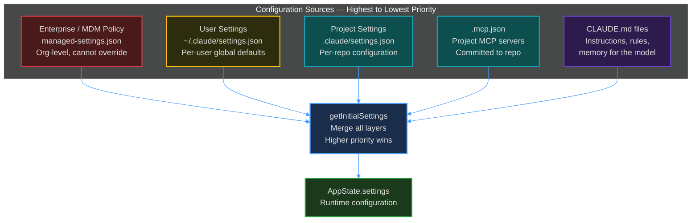
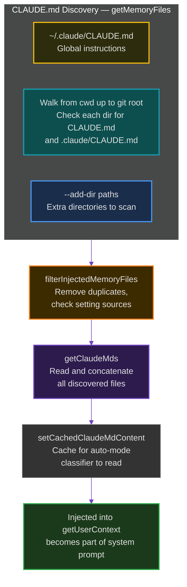
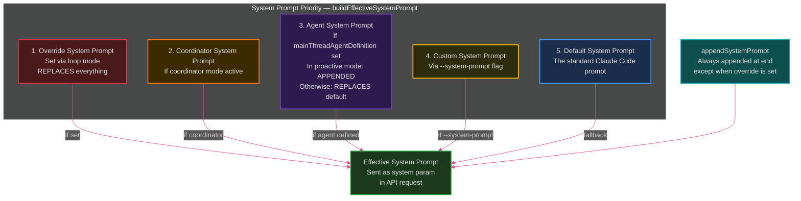
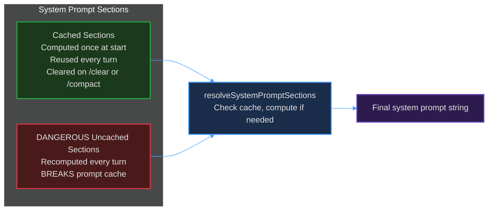
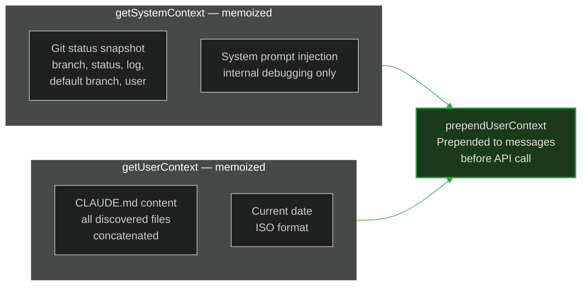
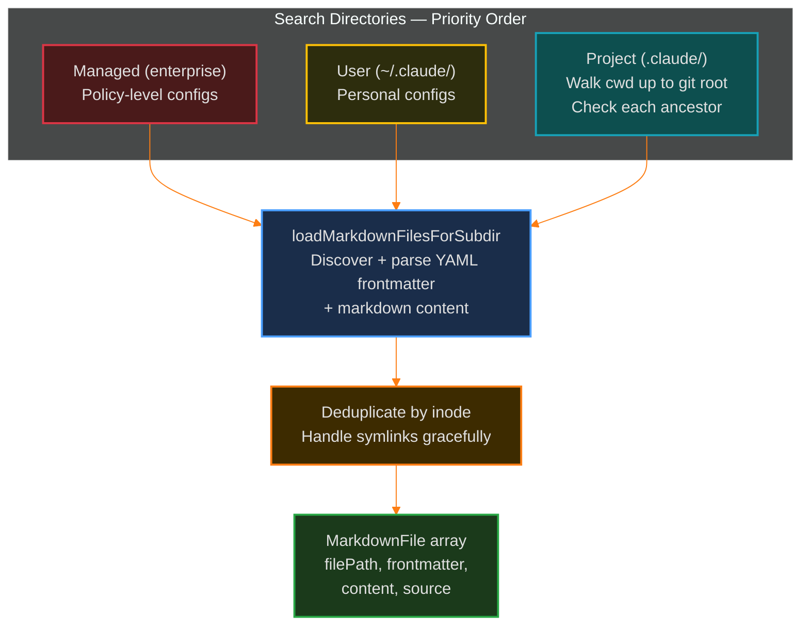

# 10. Configuration and System Prompt

> How settings cascade from enterprise policy down to project CLAUDE.md, and how the system prompt is assembled.

---

## Configuration Hierarchy

Claude Code loads settings from **5 layers**, each with strict priority. Higher layers override lower ones.

### Enterprise / MDM Policy

Highest priority. Set by organization admins via Mobile Device Management (macOS profiles). Stored at a managed file path. Users **cannot** override these settings. Controls things like:
- Allowed/denied MCP servers
- Permission mode restrictions
- Feature availability
- Analytics opt-out

### User Settings (`~/.claude/settings.json`)

Per-user defaults. Controls preferences like allowed tools, custom deny rules, and hooks.

### Project Settings (`.claude/settings.json`)

Per-repository settings. Committed to the repo so all collaborators share the same configuration.

### `.mcp.json`

MCP server definitions for the project. Lives at the repo root. Defines which MCP servers are available. Validated via Zod schema (`McpServerConfigSchema`).

### CLAUDE.md

Markdown instruction files that the model reads as part of its system prompt. These are the "memory" files that tell Claude about this specific project.

---

## CLAUDE.md Discovery

CLAUDE.md files are discovered from multiple locations and merged:

The `--bare` flag skips auto-discovery but still honors explicit `--add-dir` paths.

---

## System Prompt Assembly

The system prompt is what the model "sees" before any conversation messages. It's assembled from multiple pieces:

### System Prompt Sections

Individual sections of the system prompt are defined via `systemPromptSection()`:

Most sections are **cached** (computed once, reused every turn) to preserve prompt cache hits. Volatile sections that recompute every turn are explicitly named `DANGEROUS_uncachedSystemPromptSection` as a warning.

---

## Context Injection

Beyond the system prompt, two context objects are injected into every conversation:

Both are **memoized** and cached for the duration of the conversation. They're cleared on `/clear` and `/compact`.

---

## Markdown Config Discovery

Commands, agents, skills, and workflows are all loaded via `markdownConfigLoader.ts`:

This same loader powers:
- Slash commands (`.claude/commands/`)
- Agents (`.claude/agents/`)
- Skills (`.claude/skills/`)
- Workflows (`.claude/workflows/`)
- Output styles (`.claude/output-styles/`)

Each entry is parsed with YAML frontmatter for metadata (description, tools, etc.) and the markdown body becomes the instructions.

---

## Key Files

- `src/utils/systemPrompt.ts` — `buildEffectiveSystemPrompt()` logic
- `src/constants/systemPromptSections.ts` — Section caching system
- `src/context.ts` — `getSystemContext()`, `getUserContext()`, git status
- `src/utils/markdownConfigLoader.ts` — CLAUDE.md and `.claude/` directory discovery
- `src/utils/claudemd.ts` — Memory file reading and concatenation
- `src/utils/settings/settings.ts` — Settings merge logic

---

**Previous:** [<- UI Architecture](./09-ui-architecture.md) | **Next:** [MCP Deep Dive ->](./11-mcp-deep-dive.md)
