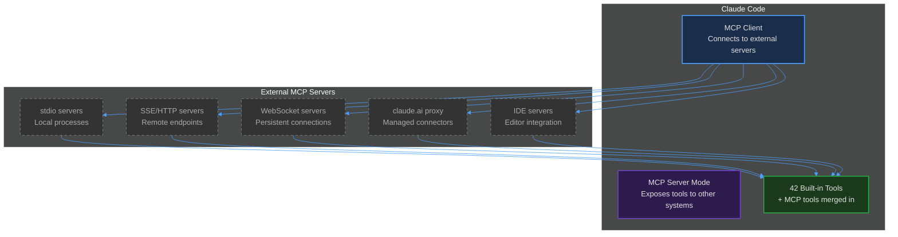
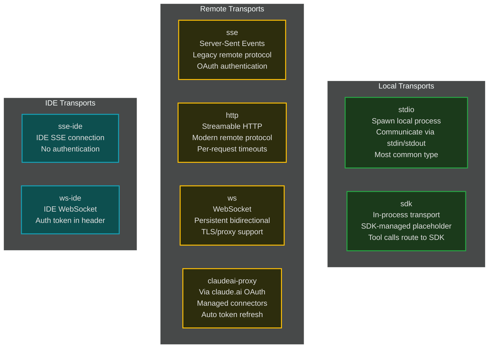
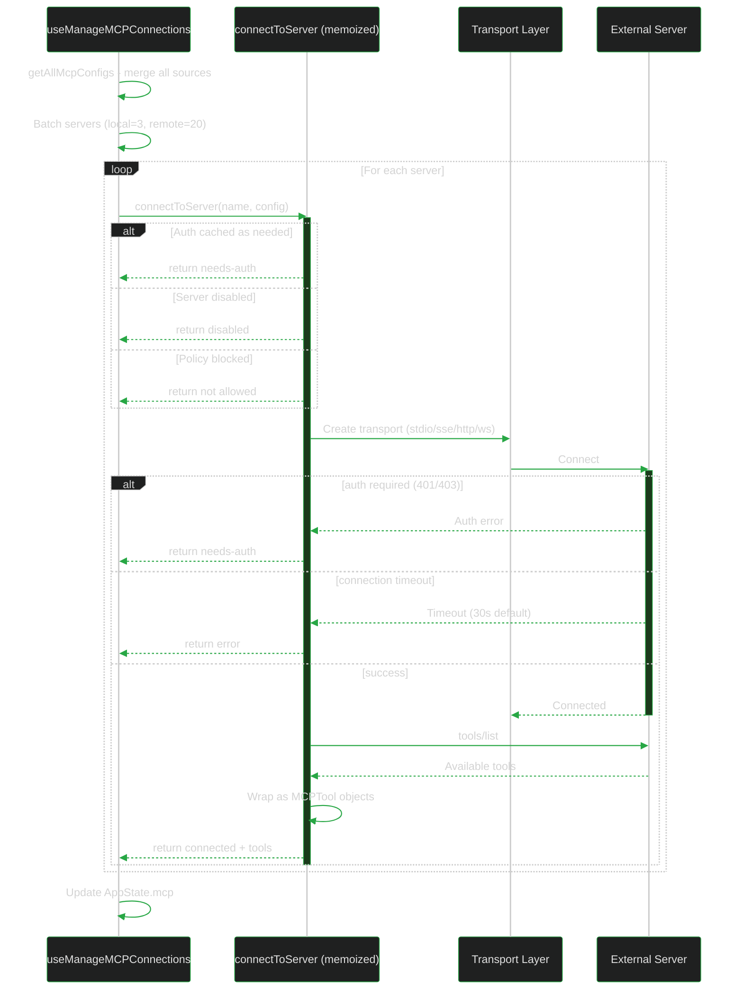
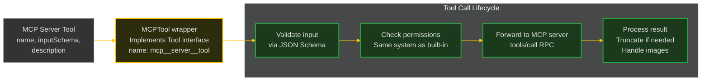
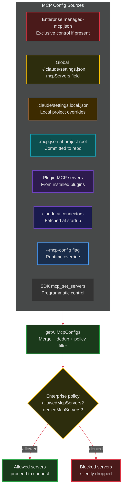
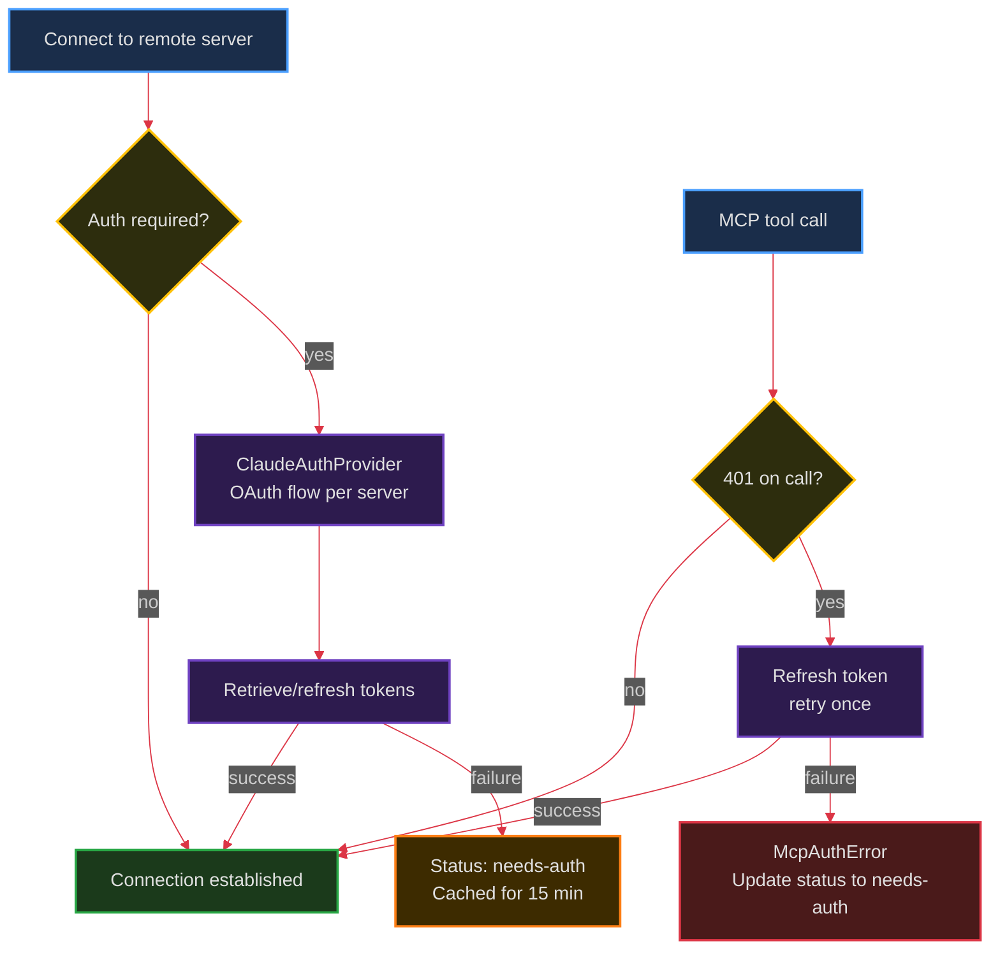

# 11. MCP Deep Dive

> The Model Context Protocol subsystem -- transports, tool wrapping, authentication, and server lifecycle.

---

## What is MCP?

MCP (Model Context Protocol) is an open protocol for connecting AI models to external tools and data sources. Claude Code is both an **MCP client** (connecting to external MCP servers) and can act as an **MCP server** (exposing its own tools to other systems).

---

## Transport Types

Claude Code supports **6 transport types** for connecting to MCP servers:

---

## Connection Lifecycle

### Batched Connections

Servers are connected in parallel batches to avoid overwhelming the system:
- **Local (stdio) servers**: batch size of 3 (spawning processes is heavy)
- **Remote servers**: batch size of 20 (network connections are lighter)

The batch sizes are configurable via `MCP_SERVER_CONNECTION_BATCH_SIZE` and `MCP_REMOTE_SERVER_CONNECTION_BATCH_SIZE` environment variables.

---

## Tool Wrapping

Each MCP tool is wrapped in a `MCPTool` object that implements the standard `Tool` interface:

### Naming Convention

MCP tools are named `mcp__<server>__<tool>`:
- `mcp__slack__send_message`
- `mcp__github__create_issue`
- `mcp__ide__getDiagnostics`

The double-underscore separators prevent ambiguity. In SDK no-prefix mode, tools keep their original names.

### Description Capping

MCP tool descriptions are capped at **2,048 characters**. OpenAPI-generated servers have been observed dumping 15-60KB of endpoint docs into descriptions, which wastes context tokens.

---

## Configuration Sources

MCP server definitions come from multiple sources, merged with priority rules:

### Deduplication

Plugin and claude.ai connector servers are deduplicated against manually-configured servers:
- **Signature-based**: Same `command+args` (stdio) or same `url` (remote) = same server
- **Manual wins**: If a user manually configured a server, the plugin/connector duplicate is suppressed
- **First-loaded wins**: Between plugins, the first one loaded takes priority

---

## Authentication

Remote MCP servers may require OAuth authentication:

### Session Expiry Handling

MCP servers return HTTP 404 + JSON-RPC error code `-32001` when a session expires. Claude Code detects this, clears the connection cache, and reconnects automatically (`McpSessionExpiredError`).

---

## Key Files

- `src/services/mcp/client.ts` (3,349 lines) -- Connection manager, tool wrapping, transport creation
- `src/services/mcp/config.ts` (1,579 lines) -- Config merging, policy filtering, deduplication
- `src/services/mcp/types.ts` -- Type definitions for server configs and connections
- `src/services/mcp/auth.ts` -- OAuth provider and step-up authentication
- `src/services/mcp/useManageMCPConnections.ts` -- React hook managing connection lifecycle
- `src/tools/MCPTool/MCPTool.ts` -- MCPTool wrapper implementing the Tool interface

---

**Previous:** [<- Configuration](./10-configuration-and-system-prompt.md) | **Next:** [Data Flow Walkthrough ->](./12-data-flow-walkthrough.md)
