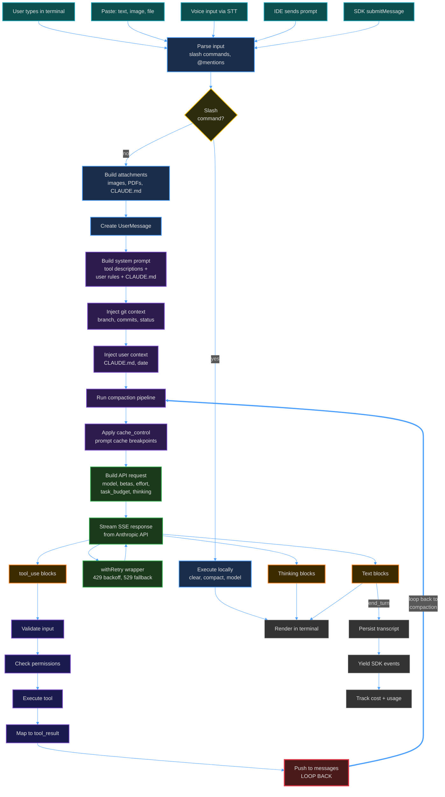
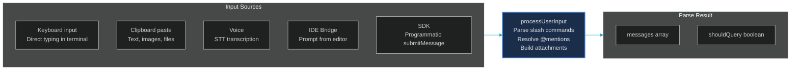
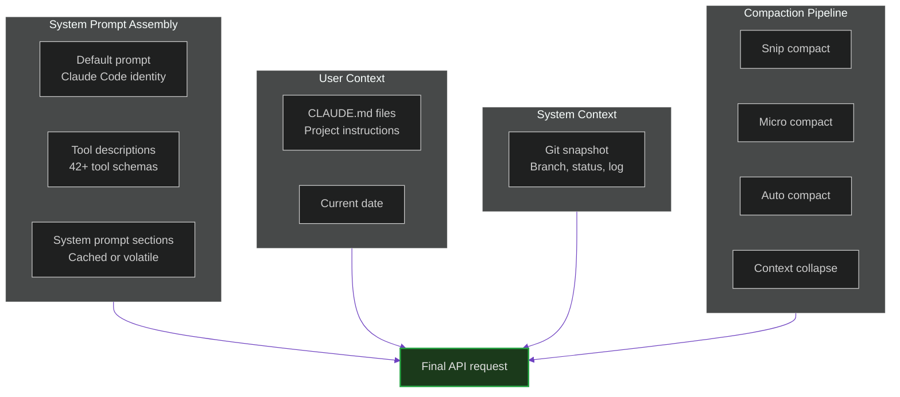
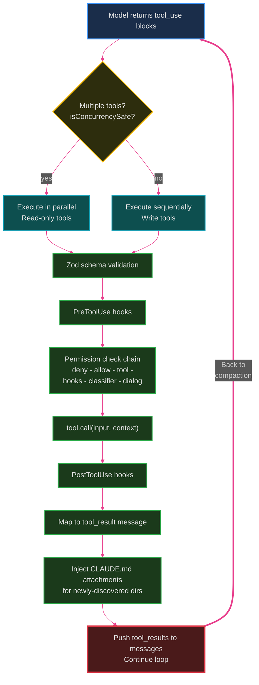
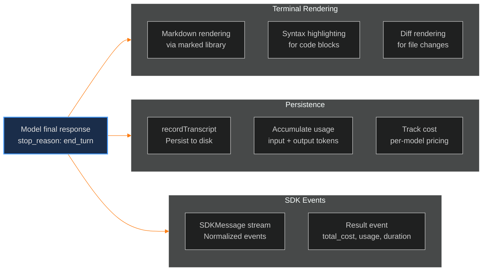
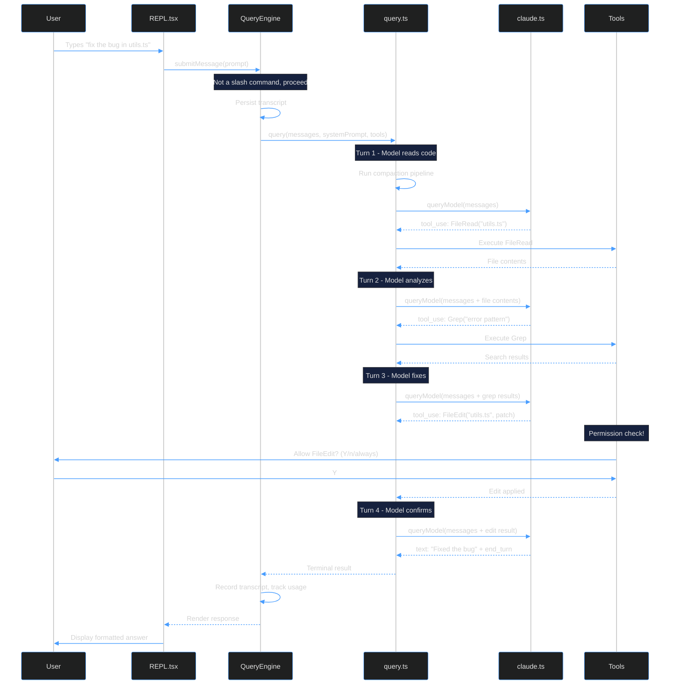

# 12. Data Flow Walkthrough

> Tracing a single user request from keystroke to rendered response -- end to end.

---

## The Complete Flow

This diagram traces exactly what happens when a user types a prompt and presses Enter.

---

## Phase by Phase

### Phase 1: Input Capture

The user's input can arrive from **5 different sources**, all converging into `processUserInput()`:

Slash commands (`/clear`, `/compact`, `/model`) are intercepted here and handled locally without an API call. Everything else proceeds to the model.

### Phase 2: Context Assembly

Before sending to the API, the system assembles context from multiple sources:

### Phase 3: API Call and Streaming

The request goes through `claude.ts` with retry logic:

```mermaid
%%{init: {'theme': 'dark', 'themeVariables': { 'primaryColor': '#1a1a2e', 'primaryTextColor': '#e0e0e0', 'lineColor': '#28a745', 'primaryBorderColor': '#28a745'}}}%%
flowchart LR
    REQ["API Request<br/>messages + system + tools"]:::req

    STREAM["SSE Stream"]:::stream

    subgraph Events["Stream Events in Order"]
        E1["message_start<br/>model, id, usage"]
        E2["content_block_start<br/>type + index"]
        E3["content_block_delta<br/>incremental text/tool JSON"]
        E4["content_block_stop"]
        E5["message_delta<br/>stop_reason + final usage"]
        E6["message_stop"]
    end

    REQ --> STREAM --> Events

    classDef req fill:#1a2d4a,stroke:#4a9eff,color:#e0e0e0,stroke-width:2px
    classDef stream fill:#1b3a1b,stroke:#28a745,color:#e0e0e0,stroke-width:2px
```

Each content block is one of three types: **thinking** (internal reasoning), **text** (user-facing response), or **tool_use** (triggers tool execution).

### Phase 4: Tool Execution Loop

When the model responds with `tool_use`, the agentic loop kicks in:

The loop continues until the model returns `stop_reason: end_turn`, hits `max_turns`, or is cancelled.

### Phase 5: Response Rendering

The final response is rendered and persisted:

---

## A Concrete Example

Let's trace what happens when a user types: `fix the bug in utils.ts`

This shows the typical pattern: **read first, analyze, then write** -- with permission checks only on the write operation.

---

## Key Takeaways

1. **Multiple entry points, single pipeline**: Whether input comes from keyboard, IDE, or SDK, it all converges into the same `processUserInput -> query -> claude.ts` pipeline.

2. **Compaction runs every turn**: The 5-stage compaction pipeline runs *before every single API call*, not just when limits are hit.

3. **Tools loop back**: Tool results are pushed to messages, and the entire pipeline (including compaction) runs again. This is the "agentic" part -- the model keeps going until it's done.

4. **Permissions only interrupt writes**: Read-only tools (FileRead, Grep, Glob) in default mode flow through silently. Only write operations (FileEdit, Bash, FileWrite) trigger permission dialogs.

5. **Everything is streamed**: From SSE events to async generators to React state updates, nothing blocks waiting for a full response. The user sees tokens as they arrive.

---

**Previous:** [<- MCP Deep Dive](./11-mcp-deep-dive.md)
